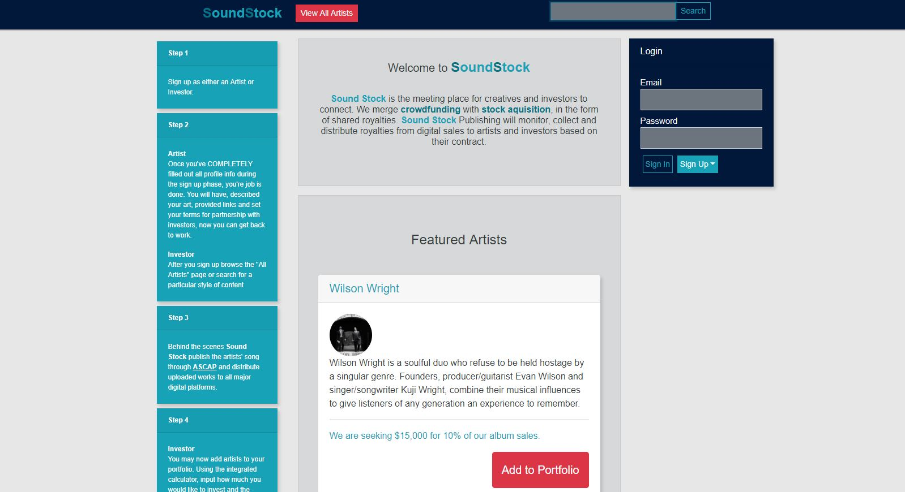
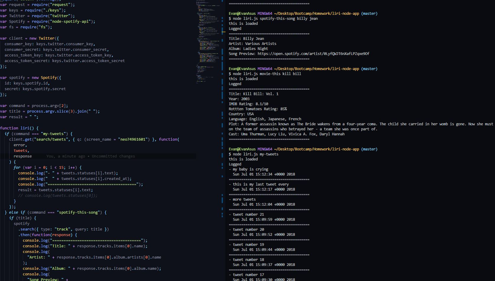

# Welcome to Evan's portfolio repository
## Here you will find links and descriptions to all projects mentioned on my portfolio

### [Soundstock.io](soundstock.io)
[View repo](https://github.com/EwilsonS/EvanSoundStock)
 

 
Social site that merges crowdfunding with shared publishing
* Mongodb
* Express
* React
* Node
* Authentication
 

### [The Lemon](https://obscure-depths-38268.herokuapp.com/)
[View repo](https://github.com/EwilsonS/NewScraper)
 

 
This is a scraper from "The Onion" news parody site
* Express
* Handlebars
* Cheerio
* Mongoose
 

### [Bamazon](https://drive.google.com/file/d/1WMO-x6bv7JJrClQ45qPYgaYJnRoshzBE/preview)
[View repo](https://github.com/EwilsonS/bamazon)
 

 
 This is a CLI inventory tracker
* MySql
* Node
* Inquirer
 

### [Project Fitness](https://young-hamlet-41284.herokuapp.com/)
[View repo](https://github.com/EwilsonS/Project2)
 

 
(group project)
 
Fitness app that allows users to create workouts and track progress
 
My contribution
* Authentication
* Front-end design

Whole app
* Express
* Sequelize
* Handlebars
* Bootstrap
* Passport
 

### [Friend Finder](https://rocky-sands-70274.herokuapp.com)
[View repo](https://github.com/EwilsonS/friend_finder)
 

 
App that allows users to fill out a survey and be matched with compatible users.
* Express
* Body-parser
* Path
* Node
 

### [Train Scheduler](TrainDatabase/index.html)
[View repo](https://github.com/EwilsonS/ewilsons.github.io/tree/master/TrainDatabase)
 

 
User friendly scheduling app.
* Firebase
* Moment.js
* jQuery
 

### [Non-Stop Flights](EvansTravels/index.html)
[View repo](https://github.com/EwilsonS/ewilsons.github.io/tree/master/EvansTravels)
 

 
Flight info retrieval App
* Ajax
* jQuery
* Materialize
 

### [L.I.R.I.](https://drive.google.com/file/d/19i75RcGe1XM1sYTHVPXZGUzNYzXhfw7E/preview)
[View repo](https://github.com/EwilsonS/liri-node-app)
 

 
LIRI is a CLI Language Interpretation and Recognition Interface
* NPM
* Node
* Inquirer
